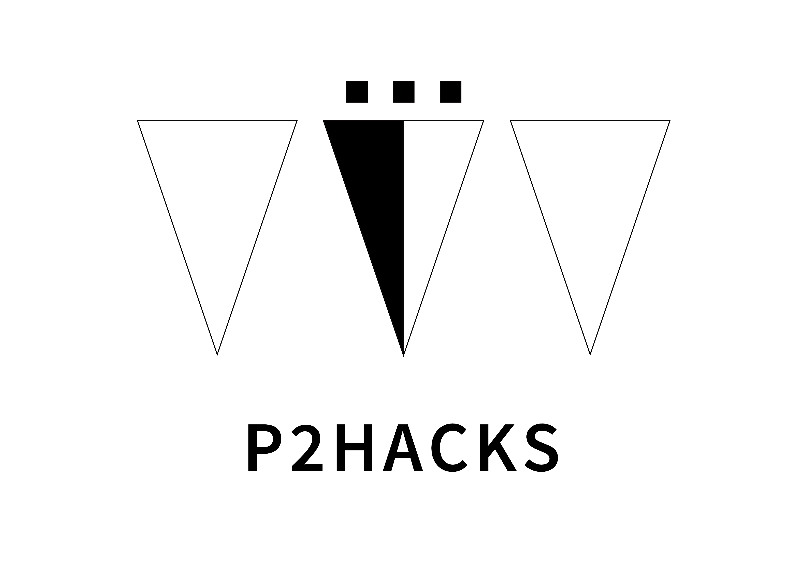

# Atta!

## 製品概要

### コンセプト
クラスメイトや友人を覚えるサポーター
### 背景
新生活になると新しい人との出会いが増える。  
しかし、「顔と名前が一致しない」「なかなか名前を覚えられない」といった、  
悩みを抱える人も少なくはないと思う。  
このアプリはそんな人に向けて、少しでも上記の問題を  
解決できるツールになるのではないかと思い作成した。  

### 製品説明
初めて出会った人とフレンド登録をすることで相手と会ったという記録を残し、  
間があいて再び会った時でも思い出しやすくなり話しやすくすることができるアプリ。
- 実装済みの機能
  - 個人のプロフィールを登録
  - フレンドのリスト化
- 実装予定の機能
  - サーバーとのPTTH通信を可能にする 
### 特長
初めて会った人と「会った」という記録が残ること。    

### 解決出来ること
友人やクラスメイトの顔や名前を覚えやすくなる  

## 開発内容・開発技術
- iPhoneアプリ(クライアント)の作成
- アプリケーションサーバーを立てる
### 活用した技術
- xcode
- Vagrant
- Ansible
- git
- Boostnote
- ngrok
#### 言語
- Swift4
- Ruby 2.5.2

#### フレームワーク・ライブラリ・モジュール
- Ruby on rails  
- MySQL 5.2

#### デバイス
- iPhone7 (推奨)

#### ファイルについて
- db_server：アプリケーションサーバーとデータベースを立ち上げる  
- hoge：アプリケーション  
- create_db_server：サーバー開発環境の自動化するためのファイル  

## メンバーの役割
- 田澤 卓也：クライアント作成  
- 越 優希：クライアント作成  
- 山田 咲太郎：システム設計、サーバサイドの開発、チームメンバーへの指示  
- 小路 智也：UIデザイン設計および作成  
- 伊藤 晋梧：UIデザイン設計および作成  
## 今回のハッカソンで得たこと学べたこと
- 限られた時間内に成果物を作成する難しさと、設計やスケジュール管理の大切さ。
- チームワークの大切さを学んだ。
- 開発手順を踏んだり、こまめなIssue作成の重要性

